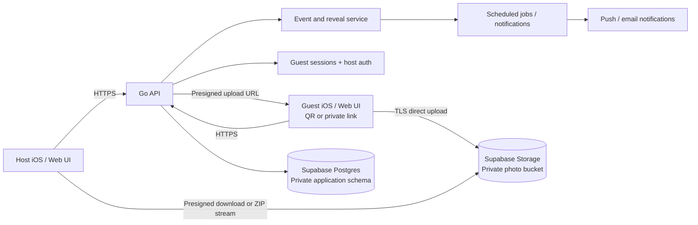

# OneShotOneNight — high-level system design

The client stays deliberately thin: event rules and access decisions live in the API, while image bytes move directly between the client and object storage through short-lived presigned URLs.

## Primary flow

1. The host creates an event; the API stores its limits and reveal timestamp and returns a capability-based guest link plus QR payload.
2. A guest opens that link, exchanges it for an HttpOnly guest session, and requests a presigned upload URL.
3. The guest uploads directly to object storage. The API records metadata and enforces guest, event, and photo limits.
4. Gallery reads return locked metadata before `reveal_at`. A scheduled job marks the event revealed and optionally notifies the host.
5. After reveal, authorized participants receive short-lived image URLs. Hosts may request a streamed ZIP export.

## Scale and security

- HTTPS/TLS everywhere; private buckets; short-lived signed URLs; hashed invitation/session secrets; server-side MIME and size validation.
- Stateless API instances behind a load balancer; database indexes on event, guest, and reveal time; object storage handles media throughput.
- A durable job queue makes reveal and notification work retryable. Dozens of concurrent events and hundreds of uploads require no special partitioning at this scale.
